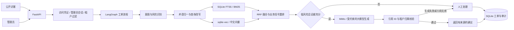

# 系统架构

## 核心边界

- `tenant_id` 只由服务端会话决定，不接受请求参数中的租户值。
- 公开访客凭创建工单时返回的随机凭证读取自己的工单；数据库只保存凭证哈希。
- 管理员使用签名、限时、HttpOnly 的会话 Cookie，写操作还需要 CSRF 令牌。
- 高风险或证据不足的工单不会显示为已自动执行，只进入人工处理状态。
- 模型只能引用本次检索返回的段落 ID；服务端再次校验引用与租户归属。
