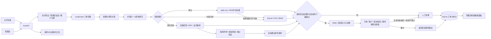

# 系统架构

## 核心边界

- `tenant_id` 只由服务端会话决定，不接受请求参数中的租户值。
- 公开访客凭创建工单时返回的随机凭证读取自己的工单；数据库只保存凭证哈希。
- 管理员使用签名、限时、HttpOnly 的会话 Cookie，写操作还需要 CSRF 令牌。
- 高风险或证据不足的工单不会显示为已自动执行，只进入人工处理状态。
- 模型只能引用本次检索返回的段落 ID；服务端再次校验引用与租户归属。

## 评测与运行状态

- 旧关键词算法冻结在 evaluation 中，生产代码只使用 knowledge 检索入口。默认纯向量；不可用时回退BM25。混合配置的两路检索依次执行，不宣称并发搜索。
- sqlite-vec 对当前租户有效向量做精确余弦扫描；RRF及业务信号为轻量规则重排，没有ANN或Cross-Encoder。
- 文档分块保留标题路径，按句子切分，超长单句才按长度兜底。引用同时保存文档版本、段落ID和稳定chunk_key。
- 证据评分不是正确概率。阈值只在校准集选择，冻结测试决定是否开放自动建议；BM25、向量、混合三种模式均未达到95%测试门槛，默认人工审核。
- 引用有效性不等于语义支持。生成器真实实验保留答案与资料，语义审查单独注明AI审查；模型只选择候选句子ID，服务器校验后读取原文并记录逐句段落、版本和chunk_key，模型自由文字不作为答复；这不是NLI，也不能证明来源本身正确或与问题相关。
- `/health` 检查数据库、向量扩展、模型维度、有效覆盖及最近运行情况。旧索引没有运行验证时明确标为待验证；不在健康检查中下载模型或调用付费服务。
- `/health/live` 只证明进程存活。管理员统计仅覆盖会话租户，缺字段的历史工单单列，不当作零值计入分母。

- 8项检索信号＋逻辑回归已经做离线预留集实验，95%发布门槛未通过，当前没有改成线上默认判别器。新60题与历史测试集分开保存，阈值没有根据新结果重调。
