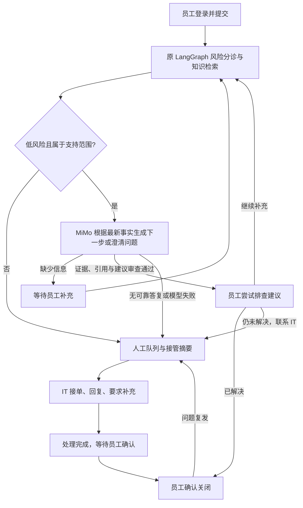

# Atlas 员工与 IT 工作流

员工服务台：https://ticket.su46proj.site/ 。IT 管理台：同域名 `/admin`。

员工页面聚焦问题、回复、补充和进度。检索评分、发布评测、原始资料与审计放在管理台。“我的工单”由服务端按账号 ID 与租户过滤；管理台默认显示待人工处理的工单。

## AI 辅助与人工接管

保留 FastAPI、LangGraph、SQLite/FTS5、BGE/sqlite-vec、MiMo及原图节点和边。新增 `app/assistance.py`，用于显式开启的只读辅助模式：模型根据首次描述、按时间排列的员工与AI对话，区分已知情况、缺失信息及已尝试无效的操作，生成澄清、下一步建议或交接说明。步骤可通俗改写，但必须引用检索句子ID；服务端检查租户、文档有效版本、引用和危险内容，另一次模型调用核对操作依据与上下文。建议审查失败最多修正一次，仍失败则转IT，每次调用计入额度。澄清与交接不发布维修步骤，使用结构和敏感内容校验。默认正式模式继续使用原句子ID选择协议。

打印机与蓝屏补充均为独立知识文档，沿原检索链召回，不按标题返回固定代码文案。比如“屏幕缺纸”先区分纸盒空与有纸误报；确认空后给装纸与观察结果；已装纸、核对设置仍失败时不重复旧步骤，交接同一工单与已尝试情况。未知设备不编造按钮位置、错误码格式或维修决定。

`LOW_RISK_ASSISTANCE` 默认关闭，正式模式仍要求原发布评测放行。个人演示显式开启只读辅助模式：低风险、有知识命中、类别受支持并启用模型时可以询问信息；发布事实性步骤仍要求校准证据与引用校验通过。不会执行系统操作、批准敏感申请或自动关闭工单。未知主题、敏感请求、无效输出、额度不足或多轮无进展转 IT，保留问题、接管原因与员工补充。

**95%是检索决策评测目标，不是单条工单置信度、维修正确率或自动解决率。原向量发布报告49/55（约89.1%）未通过，策略和历史报告未改动。新增知识与多轮交互未重新完成整套质量评测，不能把辅助模式写成正式质量门槛已通过。** 工程测试与少量真实模型验收分别记录。

AI回复和追问标注真实来源；人工接管显示回执，工作人员回复显示实际管理员账号。未接单的低风险旧工单可点击“请 AI 继续排查”，重新经过原图。敏感、已接单或关闭工单不能绕过状态限制。

员工补充在原工单重新调用处理图，不创建第二张工单；首次描述与最近对话分别传给生成器，新事实优先于旧情况，标题和最新补充用于检索。风险分诊仅使用员工输入，避免AI自身的安全说明污染分类。最多五条已记录AI回复后交接人工，澄清不会第三轮就截断；员工主动申请人工仍即时交接。重试不再伪造员工消息。状态更新使用事务和版本检查，防止模型覆盖人工新回复。重启遗留的“AI处理中”转人工并保留输入。

IT接单、回复、要求补充、标记完成；员工确认关闭或重新打开。敏感申请须先审批，通过后人工执行，重开须重新审批。页面每15秒更新，保留正在输入的草稿；重复或过期状态操作返回409。

## 身份与访问

员工演示账号支持注册、登录、退出与分页，沿用SQLite、scrypt密码哈希和签名会话。提交时绑定不可变账号ID，不按姓名过滤。读取、补充和动作必须匹配账号与租户，写操作另需CSRF；持有另一账号的工单令牌仍无法读取。

旧访客凭据继续访问旧工单，在“本浏览器旧工单”独立显示，不猜测归属或自动转到新账号。迁移前备份，仅新增账号/归属/沟通列与表，保留旧编号、描述、创建时间与访问哈希。

管理员使用 `ADMIN_USERNAME`（默认admin）与原密码哈希，生产登录同时验证Turnstile。处理人、审批人与审计身份来自服务端会话，不接受客户端伪造姓名。支持会话恢复、有效期、退出与失效提示；员工注册/登录也要求人机验证，登录与提交各用独立令牌。

员工和管理员使用独立的HttpOnly/Secure/SameSite=Strict Cookie，8小时有效；登录/注册限流，写入CSRF。验证码在对应操作区，先验证必填项，再提交并重置令牌；验证码不是工单创建成功或重复状态控制。Atlas SVG图标在员工、管理与介绍页同步。

目前为单管理员配置与员工演示账号，尚未接入企业SSO、邮箱验证、密码找回、管理员多角色和MFA，不能称为完整企业IAM。管理员重置密码由维护者调整配置。

## 验证边界

64项工程测试通过，包含同名员工隔离、角色与CSRF、审批、重复动作、同工单多轮、旧工单重试、危险追问、来源校验、审查拒绝后的有限修正与员工/AI上下文隔离。真实MiMo在隔离容器验收打印机症状澄清、错字补充、确认空纸盒后装纸建议、已尝试无效后交接，以及蓝屏已恢复后的建议和敏感/未知主题转人工。人工逐条检查回复，调试中未通过的候选不发布；少量模拟样本不代表质量评测或自动解决率。

关闭模型的独立384MiB容量检查40/40成功，不能当作真实模型吞吐成绩。本次生产验收采用只读健康/权限检查与登录布局检查：缺少验证码的注册、登录、创建在写库前拒绝，未向生产库添加验收数据或调用模型。正常浏览器挑战和当前版生产完整认证流转没有自动完成；完整流程与真实MiMo回复来自隔离测试。原始报告保存于部署目录。
